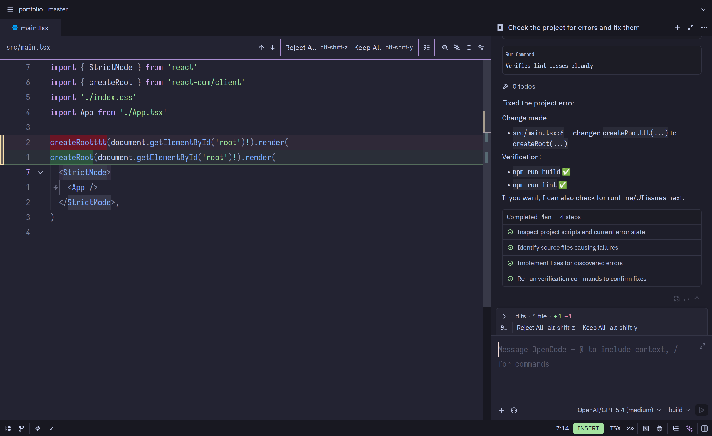
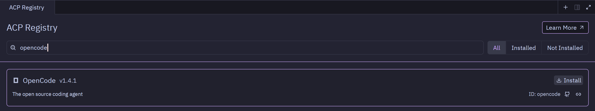

# This is a fork of opencode that adds native change preview support in the Zed editor



Issue: [#4240](https://github.com/anomalyco/opencode/issues/4240)</br>
PR: [PR 22290](https://github.com/anomalyco/opencode/pull/22290)</br>

Original PR: [PR 6902](https://github.com/anomalyco/pencode/pull/6902)</br>
Thanks to [ncwade](https://github.com/ncwade).


## Installing
Install opencode ACP in Zed.



</br>Then delete the binary from the registry folder:
```bash
 rm -rf ~/.local/share/zed/external_agents/registry/opencode/(your-installed-version)/opencode
```

</br>Clone this repo and run the following commands:
```bash
cd packages/opencode
```

```bash
bun install
```

```bash
bun run build 
```


</br>Then go to the dist folder, choose your architecture, and create a symlink for Zed:

```bash
sudo ln -s (your-project-location)/packages/opencode/dist/(your-architecture)/opencode \
 ~/.local/share/zed/external_agents/registry/opencode/(your-installed-version)/
```

### <br/>Done, everything should work.<br/></br>

Note: Since there isn't a script yet, you'll have to recreate it manually each time Zed downloads a new version of OpenCode.

Second note: This repository will remain active and will be updated until the pull request is merged.
